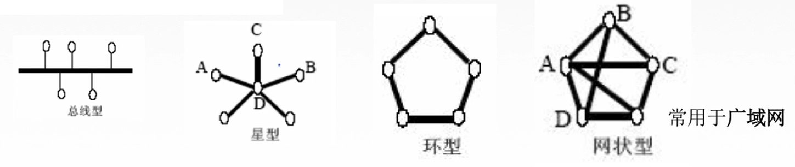

# 计算机网络
计算机网络是将一个个`分散的、具有独立功能的`计算机系统，通过`通信设备`与`线路`连接起来，由功能完善的软件实现资源共享和信息传递的系统
***

## 计算机网络的功能
1. 数据通信： 连通性
2. 资源共享： 硬件（打印机、传真机）、软件、数据（百度文库、CSDN）
3. 分布式处理：多台计算机各自承担同一工作任务的不同部分
4. 提高可靠性： 替代机，主机宕机，替代机继续发挥作用
5. 负载均衡：将负载（工作任务）进行平衡、分摊到多个操作单元上进行执行

## 计算机网络的组成
#### 组成部件
1. 硬件
2. 软件
3. 协议

#### 功能组成
1. 通信子网：各种传输介质、通信设备、相应的网络协议组成，主要体现在 OSI 七层协议的下三层： 物理层、数据链路层、网络层
2. 资源子网： 实现资源共享功能的设备和软件集合，主要体现在 OSI 七层协议的 上三层： 应用层、表示层、会话层

## 计算机网络的分类

#### 按照分布范围进行分类
1. 广域网（WAN）: 范围很大，跨国
2. 城域网（MAN）: 一个城市内的网络
3. 局域网（WAN）: 范围很小，一个教室或者一个写字楼，校园网就是一个个局域网连接起来的
4. 个人区域网络（PAN）: 个人使用无线设备相互连接起来的

#### 按照使用者进行分类
1. 公用网： 如 中国电信、中国移动、中国联通，付费即可使用
2. 专用网： 如政府、军队的网络，拥有权限者才能使用

#### 按交换技术分类
1. 电路交换
2. 报文交换
3. 分组交换

#### 网络拓扑结构

现代网络拓扑结构主要分为两个部分： 边缘部分和核心部分
1. 边缘部分： 主要指平时的用户可以直接接粗的部分，如在家、在公司或者在商场使用的网络，属于计算机网络的边缘部分
2. 核心部分： 主要有地区 ISP、主干IS以及一些国际的路由器所组成

#### 按照传输技术分类
1. 广播式网络： 共享公共通道信息
2. 点对点网络： 使用分组存储转发和路由选择机制

