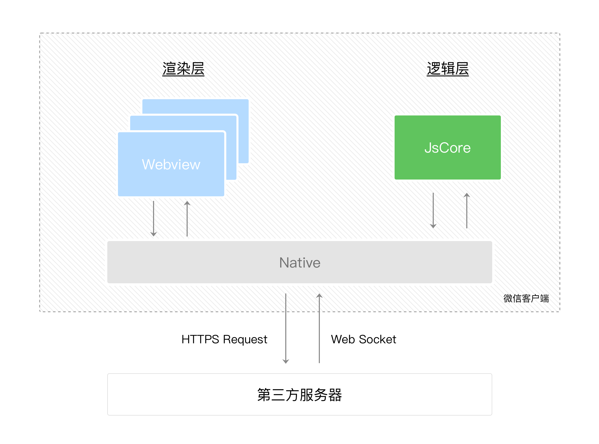
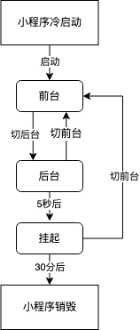

# 微信小程序

## 微信小程序开发和普通网页开发有什么区别
*小程序主要开发语言是javascript, 小程序的开发痛普通网页的开发具有很大的相似性*
1. 运行环境:  
    * 微信小程序运行在微信环境中，这意味着微信小程序具有更高的集成度和便利性，但是同时也限制了其功能和访问权限，渲染层和逻辑层是分开的
    * 普通网页运行在浏览器环境中，网页开发的渲染线程和js简本线程时互斥的
2. 开发语言:  
    * 微信小程序主要使用的是 WXML、WXSS、WXS，这是基于 XML 和 CSS 的语言
    * 普通网页开发主要使用 HTML、CSS
3. API 差异: 
    * 微信小程序提供了很多特定的API，如微信登陆，微信支付，地理位置等api
    * 普通网页开发可以使用更广泛的 Web API
4. 更新机制: 
    * 微信小程序发布时，需要经过后台审核通过才能更新，者使得更新和维护变得相对复杂
    * 普通网页开发可以随时进行发布
5. 性能优化: 
    * 微信小程序需要考虑更多的性能优化问题，如代码拆分、按需加载、懒加载
    * 普通网页开发这些可能都不是需要备首要考虑的问题
6. 安全性: 
    * 由于小程序具有更改的集成度和访问权限，因此安全性问题更加重要，开发者需要更加关注数据安全和用户隐私保护
7. 跨平台开发: 
    * 小程序可以在多个平台上运行，如微信、支付宝等。
    * 普通网页开发则需要针对不同的浏览器和平台进行适配和优化

微信小程序运行环境:
|运行环境|逻辑层|渲染层|
|--|--|--|
|IOS|JavascriptCore|WKWebView|
|安卓|V8|chromium 定制内核|
|小程序开发者工具|NWJS|Chrome WebView|

## 小程序框架系统
*微信小程序框架系统分为 **逻辑层** 和 **渲染层*** 

#### 小程序通信模型

1. 小程序的 渲染层和逻辑层分别有两个线程管理
    * 渲染层的界面使用了 WebView 进行渲染
    * 逻辑层使用 JSCore 线程运行js脚本
2. 两个线程之间的通信主要通过 微信客户端(Native) 进行通信
3. Native 客户端提供了 数据传输的事件系统
4. 小程序框架核心是 `响应的事件绑定系统`。在逻辑层修改数据的时候，通过Native通信 ，视图层也会做出响应的变化

#### 逻辑层
*开发者写的所有代码都会打包成一份js文件，并且在小程序启动的时候运行，直到小程序销毁。这一系列的行为类似于ServiceWorker, 所以逻辑层也被称为App Service*
1. 在JS 的基础上，新增了一些功能，以便于小程序的开发
    * 增加了 App 方法和 Page 方法，进行`程序注册`和`页面注册`
    * 增加了 getApp 方法 和 getCurrentPages 方法，分别用来获取 APP 实例和当前页面栈
    * 提供丰富的 API，如微信用户数据，扫一扫、支付等微信特有的能力
    * 提供模块化的能力，每个页面都有独立的作用域

#### 视图层
1. WXML(WeiXin Markup language): 描述页面结构
2. WXS(WeiXin Script): 小程序的一套脚本语言，结合 WXML ，可以构建出页面的结构
    * wxs 是内联在WXML 中的脚本段（页面渲染），通过 WXS 可以在模版中内联少量处理脚本，丰富模板的预处理能力
    * 还能用来编写简单的 WXS 事件响应函数（数据处理）
    * 使用 wsx 可以减少事件通信次数
3. WXSS(WeiXin Style Sheet): 描述页面样式

#### 事件系统（通信）
* 事件是视图层和逻辑层的通讯方式
* 事件可以将用户的行为反馈到逻辑层处理
* 事件可以绑定到组件上，当触发事件时，就会执行逻辑层中对应事件的处理函数
* 事件对象可以携带额外信息，如 id、dataset、touches
*** 
1. 事件分类
    * 冒泡事件
    * 非冒泡事件

## 小程序 Javascript 支持情况

### 1. 运行限制 [基于安全考虑，小程序中不支持动态执行js]
* 不支持使用 eval 执行 JS 代码
* 不支持使用 new Function 创建函数（`new Function('return this')` 除外）

### 2. 标准 ECMAScript 支持
* 小程序的 JS 执行环境在不同平台上存在差异，因此导致不同平台对ECMAScript标准的支持存在差异
* 小程序基础库为了尽量抹平差异，内置了 `core-js polyfill` 将平台环境缺失的标准API补齐
* 平台对 ECMAScript 的支持差异无法抹平，当需要使用一些高级语法的时候，可以通过 `代码转换工具` 实现

### 3. 尽量避免使用 无法被polyfill 的 api
* `Proxy 对象` 在部分低版本客户端中无法使用

### 4. 在IOS 下的 Promise存在时序差
* iOS 环境下的 `Promise` 是一个使用 setTimeout 模拟的polyfill，所以 Promise 触发的是普通任务而非微任务

## 小程序运行机制
小程序从启动奥销毁，会经历很多不同的状态，小程序在不同状态下会有不同的表现

#### 小程序生命周期
1. 启动
* 冷启动：用户首次打开或者小程序被销毁后再次被用户打开，此时小程序需要重新加载启动（冷启动）
* 热启动：如果用户已经打开过某个小层序，然*后在一定时间内再次打开小程序，小程序未被销毁，只是从前台进入后台，这个过程就是热启动

2. 前台与后台
* 前台： 小程序启动后，界面被展示给用户，此次小程序处于 `前台` 状态
* 后台： 当用户关闭小程序时，小程序并没有被真正关闭，而是进入了`后台状体`，此时小程序还会短暂运行一段时间，但是部分 API 的使用会受到限制

**切入小程序后台的几种方式：**
* 点击右上角胶囊按钮离开小程序
* iOS 从屏幕右滑离开小程序
* 安卓点击返回键离开小程序
* 小程序前台运行时直接把微信切后台（手势或home键）
* 小程序前台运行时直接锁屏
*当用户再次进入微信并打开小程序，小程序又会进入前台状态*

3. 挂起
小程序进入后台状态一段时间（`目前时5s`）之后,小程序会被销毁，即完全终止运行
* 当小层序进入后台被挂起之后，如果很长时间（`30分钟`）都未在此进入前台，小程序就会被销毁
* 当小程序占用系统资源过高，可能会被系统销毁或者被微信客户端主动回收
    * 在 IOS 上，当微信客户端在一定时间间隔内连续收到系统内存警告时，会根据一定策略，主动销毁小程序，并提示用户 【运行内存不足，请重新打开该小程序】。具体策略会持续进行调整优化
    * 建议小程序在必要时使用 `wx.onMemoryWarning` 监听内存事件警告事件，进行必要的内存清理

## 生命周期
#### 应用生命周期
1. onLaunch:  小程序初始化完成后触发，全局只触发一次
2. onShow:  当小程序启动，或者从后台进入前台时触发
3. onHide:  当小程序从前台进入后台时触发一次
4. onError:  当小程序脚本发生错误或者api调用失败时触发
5. onBackground:  当用户点击左上角关闭，或者按了Home键离开微信时触发
6. onQuit:  当小程序销毁时触发

#### 页面生命周期
1. onLoad: 页面加载时触发，一般在 onLoad中发送异步请求来初始化页面数据
2. onShow: 页面显示时触发，页面初始化完成后会启动该函数
3. onReady: 页面初次渲染完成时触发，一个页面只会调用一次，代表页面已经准备妥当，可以视图层进行交互
4. onHide: 页面隐藏时触发，切后台时会触发
5. onUnload: 页面卸载（关闭）时触发，当 open-type 为 redirect、reLaunch、navigateBack 时都是关闭当前页面
6. onPullDownRefresh: 监听用户的下拉动作，需要在`app.json` 中事先配置允许下拉刷新
7. onReachBottom: 页面上拉触底触发

#### 组件生命周期
1. created: 组件实例刚好被创建时执行
    * 此时， `this.data` 就是在 Component 构造器中定义的数据data
    * 此时还不能调用 `setData`，通常情况下，这个声明周期只应该用于给组件this添加一些自定义属性字段
2. attached:  组件完全初始化完毕、进入页面节点树后执行这个生命函数
    * 此时， `this.data` 已经被初始化为组件的当前值
    * 这个生命周期很有用，绝大多数初始化工作可以在这个时期进行
3. detached:  组件离开页面节点树之后，触发这个生命周期函数
    * 退出一个页面的时候，如果组件还在页面的节点树中，则 detached 会被触发

## 知识点巩固
#### WXML和WXSS：
1. 如何使用WXML进行页面结构搭建？
WXML 是框架设计的一套标签语言，结合 基础组件、事件系统，可以构建出页面结构

2. WXSS与CSS的区别是什么？
* `平台特性`： wxss 主要用于微信小程序，css 主要用于网页开发。虽然在微信小程序中允许使用部分css，但是两者还是存在一定的差异
* `尺寸单位`: 
    * WXSS 新增 rpx 单位，这是一种响应式的尺寸单位，可以根据屏幕宽度进行自适应调整
    * CSS 中使用 px、%、vh/vw
    * 规定屏幕宽度为750rpx，在 iPhone6 中，屏幕宽度为375px，共有750个像素，则 750rpx=375px=750像素1rpx = 0.5px = 1物理像素
* `支持的选择器存在差异`:
    * 目前 WXSS 只支持一下几种选择器:
        * .class
        * #id
        * element
        * element,element
        * ::after
        * ::before
* `API 和组件`:
    * 微信小程序提供了丰富的API和组件，如位置、设备信息、网络请求等，这些组件都可以通过WXSS进行样式定制
    * CSS 很少涉及 微信小程序定制内置组件样式的功能
* `动态样式`:
    * WXSS 允许使用js代码动态设置样式
    * CSS 通常需要通过外部样式表或者内联样式来设置样式
* `组件化开发`: 
    * 组件可以拥有自己的样式表
    * CSS 通常是全局作用
* `兼容性`:
    * CSS 具有更好的跨浏览器兼容性
    * WXSS 主要针对微信小程序平台

3. 如何使用WXSS设置样式？

#### 组件和API：
1. 微信小程序有哪些常用的组件？
2. 如何使用组件的属性、事件和方法？
3. 微信小程序提供了哪些API，如何使用它们？
4. 数据绑定和事件处理：
5. 如何进行数据绑定？
6. this.setData方法的作用和使用方式是什么？
7. 如何使用bind和catch方法绑定事件？

#### 性能优化：
1. 如何进行按需加载来减少首屏加载时间？
2. 如何使用懒加载来延迟加载非可视区域的内容？
3. 如何通过优化网络请求来提高性能？

#### 调试和测试：
1. 如何使用微信开发者工具进行调试和测试？
2. 如何使用console.log输出调试信息？
3. 如何进行断点调试？

#### 安全加固：
1. 如何对敏感操作进行校验？
2. 如何对数据进行加密？
3. 如何防止恶意请求攻击？

#### 跨平台开发：
1. 微信小程序是否支持跨平台开发？
2. 如何在不同平台上进行适配和优化？

#### 项目经验：
1. 你过去是如何使用微信小程序进行开发的？
2. 在项目中遇到了哪些问题，如何解决这些问题？
3. 你认为微信小程序在哪些方面还有待改进？

#### 未来展望：
1. 你对微信小程序未来的发展有何看法？
3. 你认为微信小程序在哪些方面还有待改进？