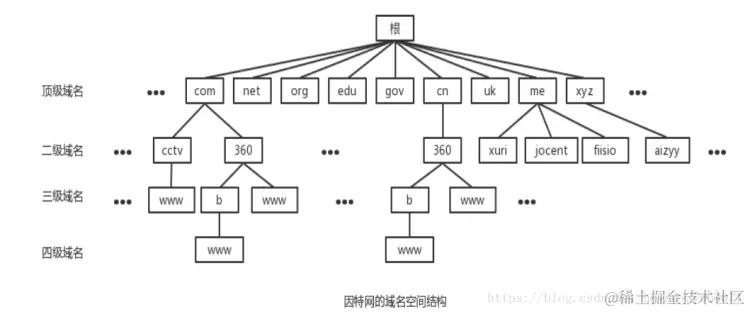

# DNS(域名系统)
DNS(Domain Name System), 域名解析协议, 主要用于将域名转化为IP地址的

## DNS 结构

## 域名解析的过程
1. 首先会在 **浏览器缓存中** 查找ip地址，如果找到直接返回，如果没有就继续下一步
2. 将请求发送给**本地的 DNS 服务器**，在本底域名服务器缓存中查找，如果找到，直接返回，没有救继续下一步
3. 本地DNS 服务器向 **根域名服务器** 发送请求，根域名服务器会返回一个所查询域的**顶级域名服务器**地址
4. 本地DNS 服务器向 **顶级域名服务器** 发送请求，接收到请求之后，服务器会先在缓存中查询，如果有就返回，没有就返回相关的下一级权威域名服务器的地址
5. 本地DNS服务器向 **权威域名服务器** 发送请求，权威域名服务器返回对应的结果
6. 本地DNS服务器将返回的结果保存在缓存中，便于下次使用
7. 本地DNS服务器将查找结果返回给浏览器

## DNS 攻击
利用DNS 系统缺陷或漏洞，通过恶意的方式对DNS系统进行干扰或破环,导致dns系统无法正常提供域名解析服务或者提供错误的域名解析结果，从而造成网络服务的不可用或用户的隐私泄露等危害。

1. DNS 泛洪攻击: 通过向DNS 服务器发送大量的查询请求，使得服务器过载并拒绝服务
2. DNS 劫持攻击: 通过篡改DNS记录，将域名解析到恶意服务器上，从而窃取用户敏感信息或传播恶意软件
3. DNS 欺骗攻击: 通过伪造DNS响应，诱导用户访问错误的网站，从而实施钓鱼攻击或恶意软件的传播

**可以采取哪些措施防范dns攻击**
* 使用高性能的DNS 服务器
* 部署DNS防火墙
* 定期更新和备份DNS记录
* 使用加密的DNS查询等
* 提高自身网络安全意识
