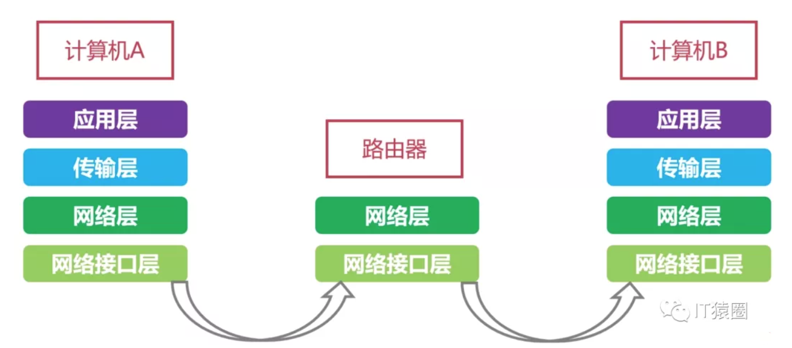

# 网络模型
***

## 网络分层
计算机网络需要解决的问题是多而繁杂的，采用分层 实现不同的功能

**计算机层次设计的基本原则：**
1. 各层之间相互独立
2. 每一层有足够的灵活性
3. 各层之间完全解耦

## OSI 七层模型
**背景： OSI七层模型在制定的时候，是想成为全球计算机都遵循的标准，然后促进全球计算机都可以沿用这个标准来方便的进行互联及数据交换。然而，OSI 在市场化的过程中困难重重，因为在OSI标准出来的时候， TCP/IP 模型在全球范围内运行成功了。因此OSI 模型只获得了理论层面的研究成果，但是在市场化方面却没能成功推进**

1. 物理层： 数据通信的光电物理特性
2. 数据链路层： 管理相邻节点之间的数据通信，确保原始数据可在各种物理媒体上传输
3. 网络层： 进行逻辑寻址，不同网络之间的路径选择
4. 传输层： 主要负责向两个主机中进程之间的通信提供服务，由于同一个主机同时运行多个进程，因此传输层具有复用和分用的功能，传输层在终端之间提供透明的数据传输，向上提供可靠的数据传输服务。传输层在给定的链路上通过流量控制、分段/重组和差错控制来保证数据传输的可靠性。传输层协议是面向链接的。这意味着传输层能保持对分段的追踪，并且重传那些失败的分段。
5. 会话层： 建立在传输层之上，利用传输层提供的服务，使应用建立和维持会话，并能使会话获得同步。会话层使用校验点可使通信会话在通信失效时从校验点继续恢复通信。这种能力对于传送打的文件极为重要
6. 表示层： 向上对应用层服务，向下接收来自会话层的服务。表示层为在应用之间传送的信息提供表示方法的服务，只关心信息发出的语法和语义
7. 应用层： 提供常见的网络应用服务

#### OSI 没有被市场所接受的原因
* OSI 专家缺乏经验
* OSI 标准制定周期长，按OSI 标准生产的设备无法及时进入市场
* OSI 模型设计得不合理，一些功能在多层中反复出现

## TCP/IP 四层模型（自下而上）
1. 网络接口层:  参考 OSI 模型中的物理层和数据链路层，负责监视数据在主机和网络之间的交换
2. 网络层： 对应 OSI 模型的 网络层，主要解决主机到逐渐之间的通信问题。它所包含的协议设计数据包在网络上的逻辑传输。IP协议是网际互联层最重要的协议，提供了一个可靠、无连接的数据报传递服务
3. 传输层： 对应 OSI 模型的传输层，为应用层提供端到端的通信功能
    * 在传输层定义了两个主要的协议： TCP(传输控制协议) 和 UDP(用户数据报协议)
        * TCP: 是一种可靠的、通过‘三次握手’来连接的数据传输服务
        * UDP: 是提供不保证可靠的、无连接的数据传输协议
4. 应用层： 对应 OSI 模型的应用层，为用户提供所需的各种服务，例如：FTP、Telnet、DNS、SMTP 等服务。

#### TCP/IP 四层模型的实际应用场景

假如计算机A 和 计算机B 通过路由器连接起来，计算机A会通过TCP/IP的四层和路由器进行通信，计算机A 的数据会通过网络接口层、网络层来到路由器（在路由器中到达的层面只有网络层和网络接口层）。路由器会将数据通过路由转发给计算机B，计算机B通过由下到上的四层来接收数据。

## 物理层

#### 物理层的作用
1. 连接不同的物理设备
2. 传输比特流
    * 比特流就是0，1这样的高低电平，或者说是数字信号

#### 传输介质
*连接不同物理设备的介质，包括`有线介质`和`无线介质`*

1. 有线介质
    * 双绞线
    * 同轴电缆
    * 光纤

2. 无线介质
    * 红外线(遥控器)
    * 无线
    * 激光

#### 比特流
*用高电平表示1， 低电平表示0， 对高电平和低电平的变化，就可以形成比特流*

#### 信道
1. 基本概念：
    * 信道是往一个方向传递信息的媒体
    * 一条通信电路往往包含一个接收信道和一个发送信道