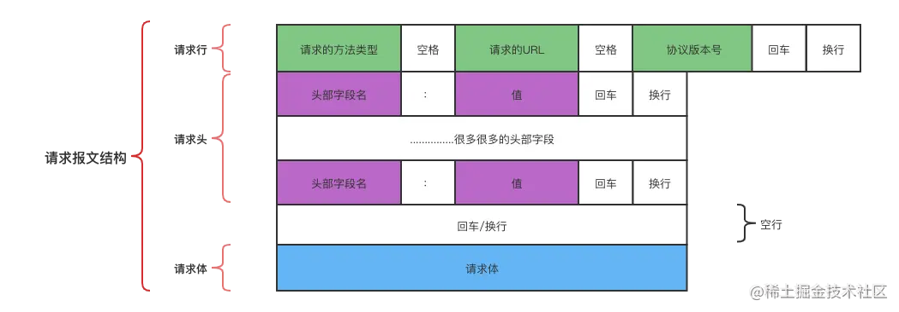

# 一、网络协议概述
网络协议是计算机网络中进行数据交换而建立的规则、标准或约定的集合。
1. 网络协议三要素：
    * 语义
    * 语法
    * 时序

2. 作用： 确保计算机之间能够进行有效的通信，规定了通信时信息 必须采用的格式和这个格式的意义，以及如何发送和接收数据，以确保数据能可靠的传输到目标地址

3. 计算机网络中，不同的协议用于不同的网络层，如 TCP/IP,HTTP,FTP等，这些协议在传输层和网络层中定义
    * 网络层协议：IP 协议、ARP协议、RARP协议
    * 传输层协议：TCP协议、UD协议
    * 应用层协议：HTTP、HTTPS、FTP、POP3、SMTP、SNMP、RDP、NTP、SSH、SIP、Telnet
***

# 二、常见的网络协议

## <一>、网络层协议

### 1.1 IP 协议
IP协议（互联网协议）是TCP/IP 协议的核心协议。定义了数据报的格式，使得数据包可以在互联网中进行传输。
* IP 协议使用IP地址进行寻址，并通过路由选择算法将数据包从源节点转发到目标节点

### 1.2 ARP 协议
ARP(Address Resolution Protocol)(地址解析协议)，作用是在以太网环境总，数据的传输所以来的是MAC地址而非IP地址。
* 将已知的ip地址转化为MAC地址的工作是由APR协议完成的

### 1.3 RARP 协议
RARP 是从MAC 地址定位IP地址的一种协议，我们平时可以通过设置电脑IP，也可以通过DHCP自动分配获取ip地址

## <二>、 传输层协议
### 2.1 TCP 协议
TCP 是 `传输控制协议`，提供 可靠的、面向连接的、基于字节流数据传输服务。
#### 2.2.1 TCP的特点
* 面向连接、可靠的数据传输、流量控制、拥塞控制和错误控制等

#### 2.1.2 基础概念
* TIME_WATI 状态: TIME_WAIT 状态是连接释放过程中的一个状态，当一方发送完最后一个ACK报文后，会进入 TIME_WAIT 状态，等待一段时间以确保对方接收到自己的ACK报文。这个状态可以避免出现重复连接的情况，保证连接的可靠性
* MSS(Maximum Segment Size): 指TCP段的最大长度，它是TCP 协议中定义的一个参数，用于限制连接时TCP段的数据长度。
    - mms 的大小取决于IP 数据报和TCP头部的最大长度。
    - 在建立TCP 连接时，双方会协商MSS的大小，以便在传输数据时能更有效地利用带宽，避免丢包等问题
* SYN 队列: 指在建立TCP 连接时使用的一个队列，存储等待处理的连接报文，以便服务器能够按照顺序处理这些请求并建立连接
* TIME_WAIT、SYN之间的关系： 当一方关闭连接时，它会发送一个FIN报文请求关闭连接。另一方接收到FIN报文之后也会关闭连接并回一个 ACK 报文确认收到请求。如果一方在发送完最后ACK报文后进入 TIME_WAIT 状态等待一段时间确保对方接收到自己的ACK保本，而另一方在这段时间内又发送了一个新的SYN保本请求建立新的连接，那么这个新的SYN 报文会被放入SYN队列中等待处理。

#### 2.1.3 TCP 工作原理
* TCP 通过`面相连接`的方式建立虚电路，确保数据传输的可靠性和顺序的正确性。
* 使用`确认机制、重传机制和窗口机制`来保证数据传输的可靠性
* TCP 还具有`流量控制和拥塞控制机制`，能够更具网络状况动态调整数据传输速率，避免网络拥塞和丢包问题

#### 2.1.4 三次握手
* 客户端向服务端发送一个请求建立连接的 `SYN` 报文
* 服务器接收到 `SYN` 报文之后，会给客户端返回一个 `SYN+ACK` 的报文，表示同意建立连接
* 客户端端接收到 `SYN+ACK` 报文之后，再向服务端发送一个 `ACK` 报文，表示确认连接建立

#### 2.1.5 四次挥手
* 当一方A想关闭连接的时候，会发送一个 `FIN` 报文，请求关闭连接
* 另一方B接收到 `FIN` 报文之后，会回复一个 `ACK` 报文，进入TIME_WAIT状态,表示 确认收到关闭请求
* 然后A可以发送一个 `FIN` 报文，表示关闭连接
* B 接收到 `FIN` 报文之后，`待处理完剩余的传输任务`之后，关闭连接，然后向 A 发送一个 `ACK` 报文，表示确认连接关闭的

#### 2.1.6 TCP协议中的流量控制和拥塞控制机制
* TCP 中的流量控制机制通过 滑动窗口协议实现。它通过动态调整窗口大小来控制发送方发送数据的速率，以避免接收方来不及接受数据而造成数据丢失
* TCP 中的拥塞控制机制通过 拥塞避免算法和拥塞窗口机制实现。它通过动态调整窗口大小来控制发送方发送的速率，以避免网络拥塞发生 

#### 2.1.7 如何处理丢包和延时？
* TCP 中处理延时和丢包的情况主要依靠`重传机制`和`拥塞机制`来实现 
* 当接收方未收到数据是，会发送一个 `NAK 或者 RST` 报文给发送方要求`重传数据或者关闭连接`
* 同时，TCP 还会`动态调整拥塞窗口`的大小以避免网络拥塞的发生，并减少丢包的可能性
* 此外， TCP 还采用 `快速重传和快速回复等算法` 来快速处理丢包和延迟的情况，提高数据传输的效率和可靠性

#### 2.1.8 如何保证数据传输的可靠性和顺序性
* TCP 中，为了保证数据传输的可靠性和顺序的正确性，主要采用 确认机制、重传机制、序列号机制和流量控制机制 等机制来实现
* 通过 `确认机制` 和 `重传机制` 保证数据能够可靠地传输到接收方
* 通过 `序列号机制` 保证数据能够按照发送的顺序进行接收
* 通过 `流量控制机制` 避免接收方来不及接受数据而造成数据丢失或者重复接收的情况发生

### 2.2 UDP 协议
UDP 是 `用户数据报协议`， 提供无连接的数据传输服务。UDP 在传输数据之前不需要建立连接，页不提供数据包的重传价值。适用于实时性要求高的应用（音视频传输、实时游戏）

#### 2.2.1 UDP 和 TCP 的区别
* UDP 和 TCP  的主要区别在于传输方式和可靠性
* UDP 提供了一种简单的方式来发送和接收数据，但是不提供任何可靠性和顺序保证，可能会出现数据丢失、重复和乱序的情况
* UDP 只需要知道接收方的 ip 和端口好即可，传输时即时性的，不用事先建立连接

#### 2.2.2 UDP 的特点和应用场景
* 特点： 简单、无连接、不可靠、支持一对一、一对多，多对一和多对多的交互通信
* 应用： 广泛应用于一些不需要可靠传输的场景，如流媒体、VoIP（语音通话）和 DNS 查询

#### 2.2.3 UDP 头部结构是什么？有哪些字段
* 头部结构包含四个字段: 源端口、目的端口、长度和校验和
* `源端口` 和 `目的端口`用于标识和接收UDP 数据报的应用程序
* `长度字段` 表示 UDP头部和数据的总长度
* `校验和` 用于检测数据在传输过程中是否发生错误 

#### 2.2.4 UDP 通信过程
* 发送方应用程序将数据打包成UDP数据报，并指定目的端的IP地址和端口号
* UDP将数据报发送到网络中，并尽力将其传递到目的端
* 接收方接收到数据之后会进行相应的处理

#### 2.2.5 UDP 有哪些传输模式，特点是什么
* UDP 传播模式主要包括 单播、广播和组播
* `单播`： 一个源端发送数据到单个目的端， 适用于 点对点通信
* `广播`:  一个源端发送数据到网络中的所有设备中， 适用于 向大量设备发送相同数据
* `组播`： 一个源端发送数据到一个特定的组中， 适用于 向一组特定设备发送数据

## <三>、应用层协议
### 3.1 HTTP 协议
HTTP 是 `超文本传输协议`， 用于在web浏览器和服务器之间传输超文本数据，支持请求和响应模型，客户端向服务器端发送请求，服务器返响应

#### 3.1.1 HTTP 协议的特点
* 无状态
* 简单快速
* 灵活
* 无需建立连接
* 可缓存
***

#### 3.1.2 请求方法有哪些？每种方法的作用时什么
|请求方法|作用|
|--|--|
| GET | 用于获取指定的资源 |
| POST| 提交数据，请求服务器处理 |
| PUT | 将数据传递到服务器以创建或者更新资源，可以用上传的内容替换目标资源中的内容 |
| DELETE | 删除指定资源 |
| HEAD| 与get请求的基本相同，不同的是HEAD请求没有响应体，仅用于传输状态行和标题部分   这对一仅查看响应头的数据非常有用，可以避免传输所有内容   常被用于客户端查看服务器的性能 |
| CONNECT | 用来建立到给定URI标识服务器的隧道，是 HTTP/1.1预留的，可将连接改为管道方式的代理服务器 |
| OPTIONS | 通常用于查看服务器性能，这个方法会请求服务器返回该资源所支持的预定义URL的HTTP策略 | 
| TRACE | 请求服务器回显其收到的请求信息，主要用于HTTP 请求的测试或者诊断 |
| PATCH | 用于资源更新 |

###### get 请求和 post 请求之间的区别
* `数据传输方式:` get 请求会将请求参数放在 URL 中，但是post请求会通过HTTP请求的body来传递数据
* `数据容量:` 因为get 请求的数据放在URL中，所以对数据的长度是有限制的；post 请求对请求参数的长度没有限制
* `数据安全性:` POST 比 get请求更安全一些，这是因为post请求的数据都在body中，而不是直接在 URL 中
* `幂等性:` get请求是幂等的，意味着多次执行相同的get请求，其效果与执行一次是一样的。post 请求不是幂等的，多次执行相同的post请求可能会产生生不同的结果
* `缓存:` get请求可以被浏览器缓存，但是post请求不能被浏览器缓存
***

#### 3.1.3 常见状态码及含义？
* 1xx: 消息状态码
    - 100: Continue 继续。客户端应当继续请求
    - 101: Switching Protocols 切换协议。服务器根据客户端的请求切换协议。智能切换到更高级的协议，例如切换到HTTP的新版本
* 2xx: 成功状态码
    - 200: 请求成功
    - 201: 成功请求，并创建了新的资源
    - 202: Accepted 已接收, 已接收请求，但未处理完成
    - 203: Non-Authoritative Information 非授权信息。请求成功，但返回的meta信息不再原始的服务器，是一个副本
    - 204: No-Content 无内容。服务器成功处理，但未返回内容。在未更新网页的情况下，可确保浏览器继续显示当前文档
    - 205: Reset Content 重置内容。服务器处理成功，用户终端应重置文档视图
* 3xx: 重定向状态码
    - 301: 请求的资源已被永久移动到新的URI，返回信息包括新的URI，浏览器回自动重定向到新的URI，之后所有的请求都用新的URI代替
    - 302: 临时移动,与301类似，但资源纵横四海临时被移动，客户端应该继续使用原有URI
    - 304: 未修改，所请求的资源未修改，服务器返回此状态码时不会返回任何资源。客户端通常会缓存访问过的资源，通过提供一个头信息指出客户端希望只返回在指定日期之后修改的资源
    - 305: 使用代理。所请求的资源必须通过代理访问
    - 307: 临时重定向。与302类似，使用GET请求重定向
* 4xx: 客户端错误状态码
    - 404: 服务器无法根据客户端请求找到资源
    - 400: 客户端请求的语法错误，服务器无法理解
    - 401: 未授权，要求客户端身份认证
    - 402: Payment Required 保留，将来使用
    - 405: 客户端请求中的方法被禁止
    - 406: 服务器无法根据客户端请求的内容特性完成请求
* 5xx: 服务端错误状态码
    - 500: 服务器内部错误，无法完成请求
    - 501: 服务器不支持请求的功能，无法完成请求
    - 502: 作为网关或者代理工作的服务器尝试执行请求时，从远程服务器接收到了一个无效的响应
    - 503: 服务器由于超载或者系统维护，暂时无法处理客户端请求。延时的长度包含在服务器的Retry-After头信息中

#### 3.1.4 HTTP 头部
* General Header 通用头
    - `Cache-Control`: 用于控制缓存策略
    - `Connection`: 指定转发时需要去掉的内容; 管理持久连接（http/1.1 默认时持久连接的），当服务器端想明确断开连接的话，指定 Connection 头部字段为 Close
    - `Upgrade`: 用于检测HTTP协议以及其他协议是否使用更高版本进行通信，其参数值可以用来指定一个完全不同的通信协议 
    - `via`: 代理服务器相关信息,报文经过代理或者网关时，会现在 via 头部字段中附加该服务器的信息，然后再进行转发
    - `Warning`: 错误和警告通知
    - `Transfor-Encoding`: 报文主题的传输编码格式（HTTP/1.1 中该字段仅对分块时候的传输编码有效）
    - `Trailer`: 会事先说明在报文主体后记录了哪些字段，常用于啊 HTTP/1.1 分块传输编码中国
    - `Pragma`: 是 HTTP/1.1 之前版本的遗留字段，仅作为与HTTP/1.0向后兼容而定义的
    - `Date`: 创建 HTTP 报文的时间

* Request Header 请求头
    - `Accept`: 用户可处理的媒体类型，可以一次指定多个
    - `Accept-Charset`: 告诉服务端，客户端想要什么字符集
    - `Accept-Encoding`:  报文压缩策略（gzip、deflate）
    - `Accept-Language`: 需要语言类型
    - `Authorization`: 携带的web 认证信息
    - `Expect`: 期待服务器的特定行为
    - `From`: 用户邮箱地址
    - `Host`: 请求资源所在服务器
    - `If-Match`: 附带条件的请求，使用附带条件和实体标记(ETag) 进行对比，相等返回200， 否则返回412 （Precondition Fail）
    - `If-Modifiled-Since`: 比较资源更新时间，资源更新时间大于该附带条件时候正常返回则返回304
    - `If-None-Match`: 比较实体标记
    - `If-Range`: 资源未更新时，针对资源的范围进行请求
    - `If-Unmodified-Since`: 比较资源更新时间
    - `Max-Forwards`: 服务器在往下一个服务器转发请求之前，Max-Forwards 的 值减 1 ,当服务器接收到 Max-Forwards 值为 0 的请求 时，则不再进行转发，而是直接返回响应
    - `Range`: 范围请求 （断点续传时候使用到了）接收到附带 Range 头部字段请求的服务器，会在处理请求之后返回状 态码为 206 Partial Content 的响应。无法处理该范围请求时，则会返 回状态码 200 OK 的响应及全部资源
    - `Referer`: 告知服务器请求原始资源的URI
    - `TE`: 告诉服务器客户端能处理响应的传输编码方式以及相对优先级
    - `User-Agent`: 会创建请求的浏览器和用户代理名称等信息传递给服务器。网络爬虫发起请求时，有可能在字段内添加爬虫作者的电子邮件地址。此外如果请求经过代理，那么中间也很可能被添加上代理

* Response Header 响应头
    - `Accept-Ranges`: 是够接收范围请求, 可指定两种字段值： bytes(可处理请求范围)，none(不接受范围处理)
    - `Age`： 告诉客户端，源服务器在多久前创建了响应，单位为 秒
    - `ETag`: 资源匹配信息， 是一种可以将资源以字符串的形式生成唯一标识的方式，服务器会为每份资源分配对应的ETag值
    - `Location`: 让客户端重定向到指定的URI，该字段会配合 3xx 的状态码，提供重定向的URI
    - `Proxy-Authenticate`: 代理服务器对客户端的认证信息，会把由代理服务器所要求的认证信息发送给客户端，
        * 它与客户端和服务器之间的HTTP访问认证行为相似，不同之处在于其认证行为是在客户端与代理服务器之间进行的
        * 而客户端和服务器之间进行认证是，其与头部字段 WWW-Authorization 有着相同的作用
    - `Retry-After`: 对再次发起请求的时机要求；告知客户端应该在做就之后再次发送请求，主要配合 503 和 3xx 响应状态码一起使用
        * 该字段值可以指定为具体的日期时间，也可以是创建响应之后的毫秒数
    - `Server HTTP`： HTTP 服务器安装信息，告知客户端当前服务器上安装的HTTP服务器应用程序的信息
    - `Vary`: 代理服务器缓存的管理信息
        * 当代理服务器接收到带有Vary头部字段指定的资源请求时，如果和使用的Accept-Language字段相同时，直接从缓存中返回响应
    - `WWW-Authenticate`: 服务器对客户端的认证信息

* Entity Header 实体头
    - `Allow`: 资源可支持的HTTP方法
    - `Content-Encoding`: body 适用的编码方式
    - `Content-Language`: body 自然语言
    - `Content-Length`: body 的大小
    - `Content-Location`: 替代对应资源的URI
    - `Content-MD5`: body 的报文摘要；md5形式
    - `Content-Range`: body 的位置范围
    - `Content-Type`: body 的媒体类型
    - `Expires`: body日期过期时间
    - `Last-Modified`: 资源的最后更改日期

#### 3.1.5 HTTP 缓存
[HTTP 缓存详解](https://blog.csdn.net/qq_42943914/article/details/129795804?spm=1001.2014.3001.5502)

#### 3.1.6 HTTP 长连接和短链接
**长链接和短链接是两种不同的TCP链接方式**
* 长链接也称为持久连接或者 HTTP/1.1连接，它允许TCP链接在发送和接收数据后仍然保持打开状态，以便后续请求和响应可以在同一链接上传输
* 短链接则是在每个请求/响应交换后关闭TCP链接的方式
* HTTP/1.0 默认使用短链接， HTTP/1.1 默认采用长链接

#### 3.1.7 如何优化HTTP请求性能？
* 减少请求次数
* 使用CDN内容分发
* 利用浏览器缓存和代理缓存
* 优化图片的质量和资源的大小
* 利用长链接和管道化请求等

#### 3.1.8 HTTP 各个版本之间有什么不同?
* **HTTP/1.0**
    - `连接管理`: HTTP/1.0 默认使用短链接，即每个请求都需要建立一个 TCP 链接，在请求完成之后关闭连接。这种方式可能会导致性能问题
    - `请求管道化`: 不支持请求流水线，即客户端在发送一个请求之后必须等待服务器响应后才能发送下一个请求，者限制了并发请求的能力
    - `缓存`: HTTP/1.0 引入了缓存机制，通过 Cache-Control、Expires 等头部字段来控制缓存行为
    - `安全性`: 没有内置的安全机制，如加密或者身份认证
 
* **HTTP/1.1**
    - `连接管理`: HTTP/1.1 默认使用长连接（Keep-Alive）,TCP 链接在发送和接收数据后保持打开状态，可以被多个请求复用。这减少了链接建立和关闭的开销，提高了性能
    - `请求管道化`： 虽然 HTTP/1.1允许在同一个TCP链接中同时发送多个请求，但它采用了基于请求/响应的模型，当服务器处理一个请求时，其他请求可能会被阻塞，这可能会导致头阻塞（Head-of-Line-Blocking）问题
    - `缓存`： 继续支持并扩展HTTP/1.0的缓存机制
    - `安全性`： 引入了更多安全性的考虑，如使用 SSL/TLS 进行加密通信，但任然存在一些安全漏洞如，跨站脚本攻击（XSS）和 跨站请求伪造（CSRF）等
    - `新方法和头部`： 引入了新的请求方法（PUT、PATCH、OPTIONS、DELETE），和头部字段，以支持更多的功能和应用场景

* **HTTP/2.0**
    - `二进制协议`: HTTP/2.0 是一个彻底的二进制协议，头部信息和数据体都是二进制格式，这提高了协议的解析效率和可扩展性
    - `多路复用`: HTTP/2.0 允许在同一个TCP链接中同时传输多个请求和响应，而不需要为每个请求建立新的连接。这消除了 头阻塞的问题，并显著提高了请求性能
    - `服务器推送`: 引入了服务器推送机制，允许服务器未经请求主动向客户端发送资源，这有助于减少页面加载时间
    - `头部压缩`: 使用头部压缩机制（gzip、compress）来减少头部信息的大小，从而降低了传输开销
    - `流量控制`: 提供了流量控制机制，允许接收方控制发送方的发送速率，以避免资源耗尽或拥塞问题
***

### 3.2 HTTPS 协议
HTTPS 是 `安全套接层超文本传输协议`， 是HTTP 的安全版本，使用加密来保护数据传输的安全性

#### 3.2.1 HTTP 协议和 HTTPS 协议之间的区别是什么？
* HTTPS 是 HTTP 协议的安全版本，通过在 HTTP 和 TCP 之间添加一个安全协议层（ssh或tls）来实现安全通信
* HTTPS 默认的端口号是443, HTTP 默认端口号是80端口
* HTTPS 提供加密、身份验证和数据完整性保护，以防止数据在传输的过程中被窃取或者篡改
HTTPS = HTTP + 身份认证 + SSL/TLS + 数据私密性 + 数据完整性

#### 3.2.2 HTTPS 加密过程
HTTPS 经由HTTP 通信，利用ssh/tls建立信息安全通道，加密数据包
**[HTTPS 加密过程](https://blog.csdn.net/qq_42943914/article/details/129748816?spm=1001.2014.3001.5502)**

#### 3.2.3 HTTPS 中的 SSH/TLS 是如何工作?
* SSH/TLS 是由受信任的证书颁发机构（CA）签发的`数字证书`，其中包含`服务器的公钥和一些标识性的信息`
* 当客户端连接到服务器的时候，`服务器会将其证书发送给客户端`
* `客户端通过验证证书的合法性`，包括检查证书是否由受信任的CA签发、证书是否过期以及证书中的域名是否正在访问的域名匹配
* 一旦证书认证通过，客户端和服务器端之间就可以使用证书中的公钥来建立加密连接 

#### 3.2.3 HTTPS 是如何防止中间人攻击的？
* HTTPS 通过验证和迷药交换来防止中间人攻击
* 在建立连接时，客户端会验证服务器端的证书和合法性，确保证书是有受信任的CA机构签发的
* 服务器也会验证客户端的证书

#### 3.2.4 HTTPS 的性能 与 HTTP的性能？
* HTTPS 相较于 HTTP 来说有一定的性能损耗，因为需要进行加密和解密，以及证书认证等步骤
* 这可能会导致连接建立的时间相对会长一些，以及加密数据可能会对cpu 和 内存资源有一定的要求
* 但是，随着技术的不断发展，现代硬件和操作系统对SSH/TLS加密的支持已经非常高效了，因此对于HTTPS 的性能损耗一般是可以接收的

***

### 3.3 SSH 协议
SSH 是 `安全外壳协议`, 用于安全登录到服务器或者网络设备，以加密数据传输和身份认证
#### 3.3.1 SSH 特点
* `安全性`： SSH 协议使用加密技术来保护数据的机密性和完整性，使用 非对称加密，服务器和客户端都会生成自己的公钥和私钥。使用SSH
            所有传输的数据都可以进行加密，从而防止中间人攻击、dns欺骗和IP欺骗等安全威胁
* `可靠性`： SSH 是一个相对可靠的协议，专为远程登录会话和其他网络服务提供安全性。
* `跨平台`： SSH 最初是一个程序，但后来迅速被扩展到其他操作系统平台。几乎所有的UNIX平台都可以使用SSH客户端和服务器
* `扩展性`： SSH 协议框架包括传输层协议、用户认证和连接协议等主要部分，同时还未许多高层的网络安全应用协议提供扩展支持
***

### 3.4 FTP 协议
FTP 是 `文件传输协议`, 用于在网络上传输文件，使用户可以上传或者下载文件到远程服务器

### 3.5 POP3 协议 和 IMAP 协议
POP3 是 `邮局协议版本3` ， IMAP 是 `Internet 消息访问协议`, 用于接收电子邮价，分本用于从服务器下载邮件或者在服务器上管理邮件

### 3.6 SMTP 协议
SMTP 是 `简单邮件传输协议`， 主要用于电子邮件的发送，规定了邮件客户端和邮件服务器之间的交互方式

### 3.7 Telnet
Telnet 用于在网络上远程登录到其他计算机，以便进行远程控制和管理

### 3.8 SNMP
SNMP 是 `简单网络管理协议`， 用于网络设备之间的监控和管理，例如路由器、交换机等。

## 3.9 RDP
RDP 是 `远程桌面协议`， 用于在计算机上显示和控制图形桌面

### 3.10 NTP 
NTP 是 `网络时间协议`， 用于同步网络中计算机的时间，确保各设备具有统一的时间标准

### 3.11 SIP 
SIP 是 `会话发起协议`， 用于建立、修改和中止多媒体会话，如 语音通话、视频通话等
